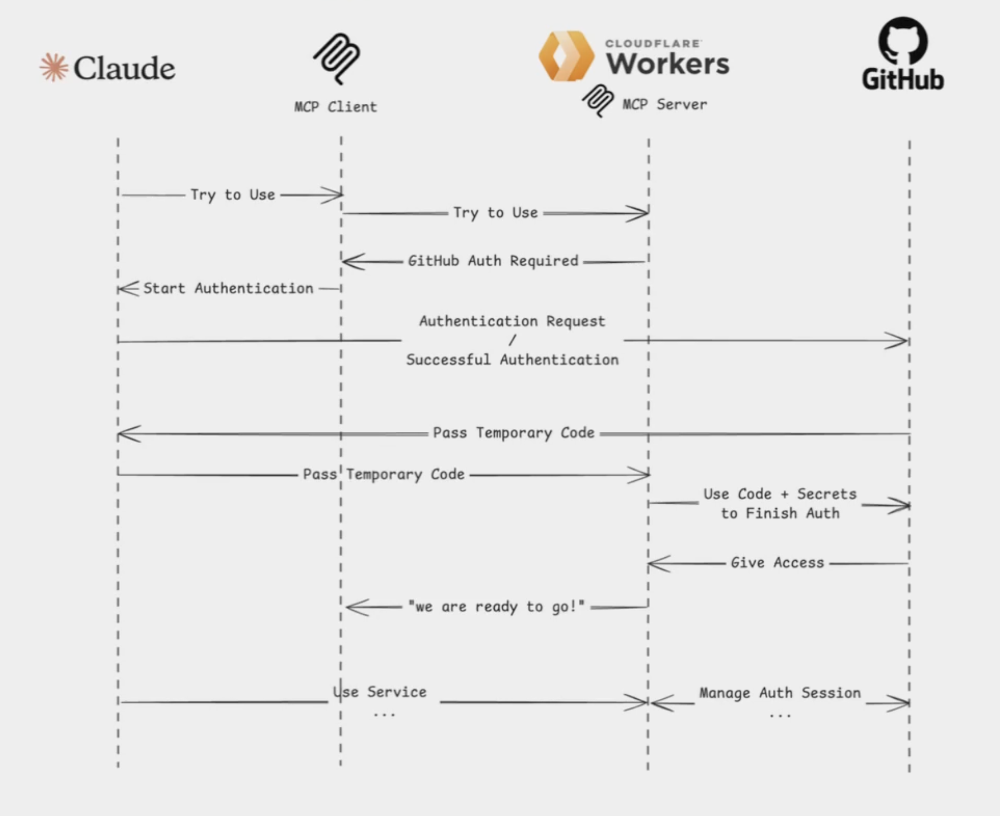
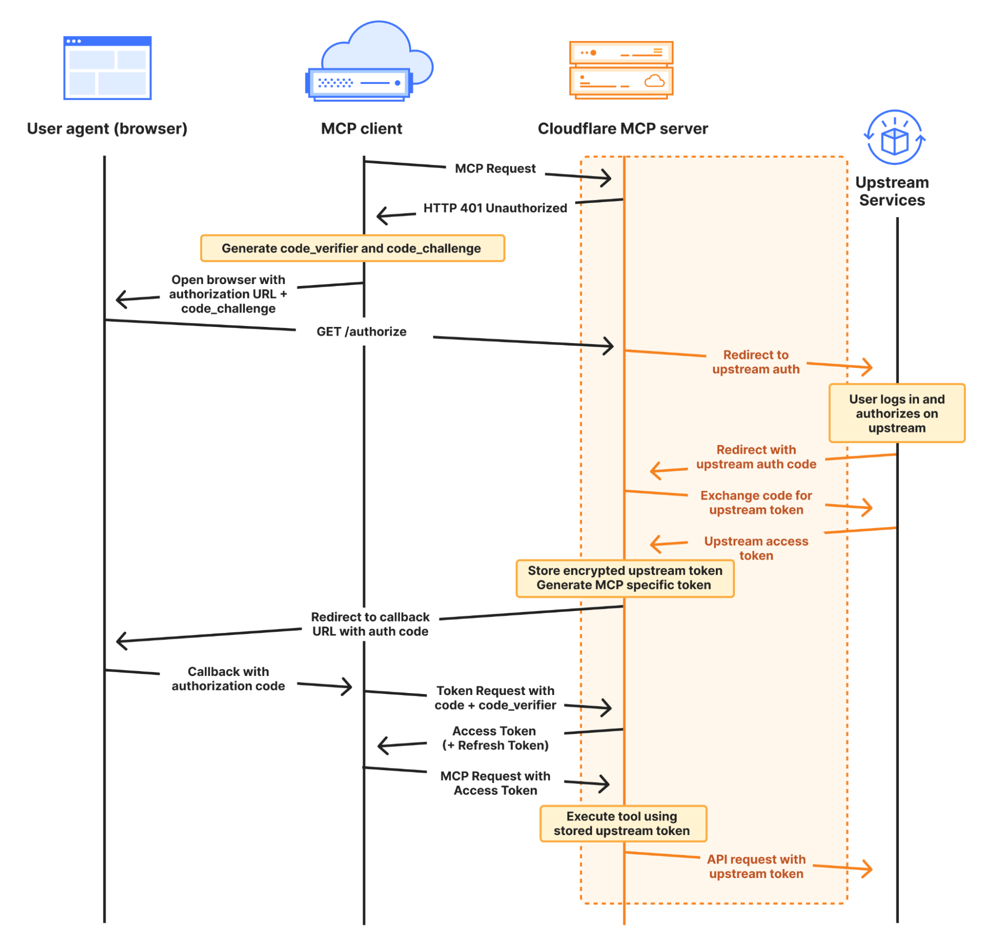

# 🚀 Deploy Secured MCP Server on Cloudflare (GitHub OAuth)

## 1. Generate the Project Boilerplate

Use Cloudflare’s project generator to scaffold a new MCP server:

```sh
npm create cloudflare@latest -- cloudflare-mcp-github-oauth --template=cloudflare/ai/demos/remote-mcp-github-oauth
```

---

## 2. Create a GitHub OAuth App

1. Visit: [https://github.com/settings/applications/new](https://github.com/settings/applications/new)
2. **Application name:** anything you like
3. **Homepage URL:** `http://localhost`
4. **Callback URL:** `http://localhost`
5. Click **Register Application**
6. Copy your **Client ID** → run:
   ```sh
   npx wrangler secret put GITHUB_CLIENT_ID
   ```
7. Click **Generate a new client secret** → copy it → run:
   ```sh
   npx wrangler secret put GITHUB_CLIENT_SECRET
   ```
8. Add cookie encryption key:
   ```sh
   npx wrangler secret put COOKIE*ENCRYPTION_KEY
   ```
   _(use any random string)_

---

## 3. Create a Cloudflare KV Namespace

```sh
npx wrangler kv namespace create "OAUTH_KV"
```

Add the created namespace ID to your `wrangler.jsonc`:

```
{
  "kv_namespaces": [
    {
      "binding": "OAUTH_KV",
      "id": "<ADD-KV-ID>"
    }
  ]
}
```

---

## 4. Add MCP Tools, Resources, or Prompts

Edit your server logic in: `src/index.ts`
This file defines the MCP tools, resources, and prompts your server exposes.

---

## 5. Test Locally

### Start the MCP server

```sh
npm start
```

### Test via MCP Inspector

```sh
npx @modelcontextprotocol/inspector@latest
```

Use these settings:

- **Transport Type:** `Streamable HTTP`
- **URL:** `http://localhost:8787/mcp`

---

## 6. Log In with Cloudflare

```sh
npx wrangler login
```

---

## 7. Deploy to Cloudflare

```sh
npx wrangler deploy
```

Your deployed Worker will output a public URL.

---

## 8. Update Your GitHub OAuth App

Update the GitHub OAuth settings to use your Cloudflare Worker URL:

- **Homepage URL:** `<your-worker-url>`
- **Callback URL:** `<your-worker-url>/callback`

Example:

```
https://cloudflare-mcp-github-oauth.n8n-testacc.workers.dev/callback
```

---

## 9. Test the Deployed Server

In MCP Inspector:

- **Transport Type:** `Streamable HTTP`
- **URL:** `<your-worker-url>/mcp`

**Example:**

```
https://cloudflare-mcp-github-oauth.n8n-testacc.workers.dev/mcp
```

---

## OAUTH WORKFLOW


**Figure:** OAuth Simplified Workflow


**Figure:** OAuth Detailed Workflow
