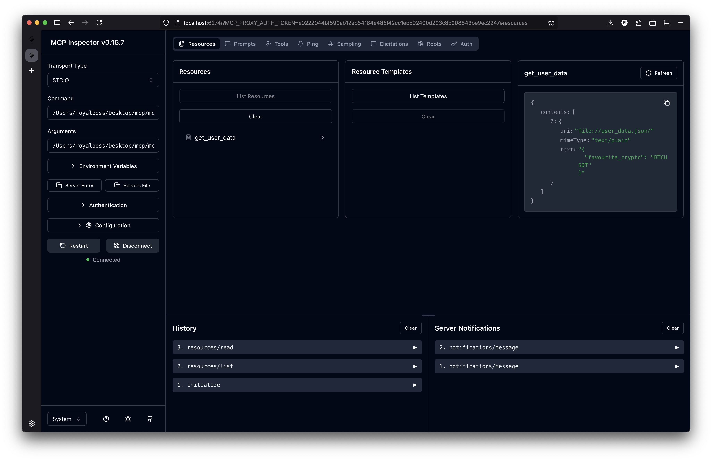
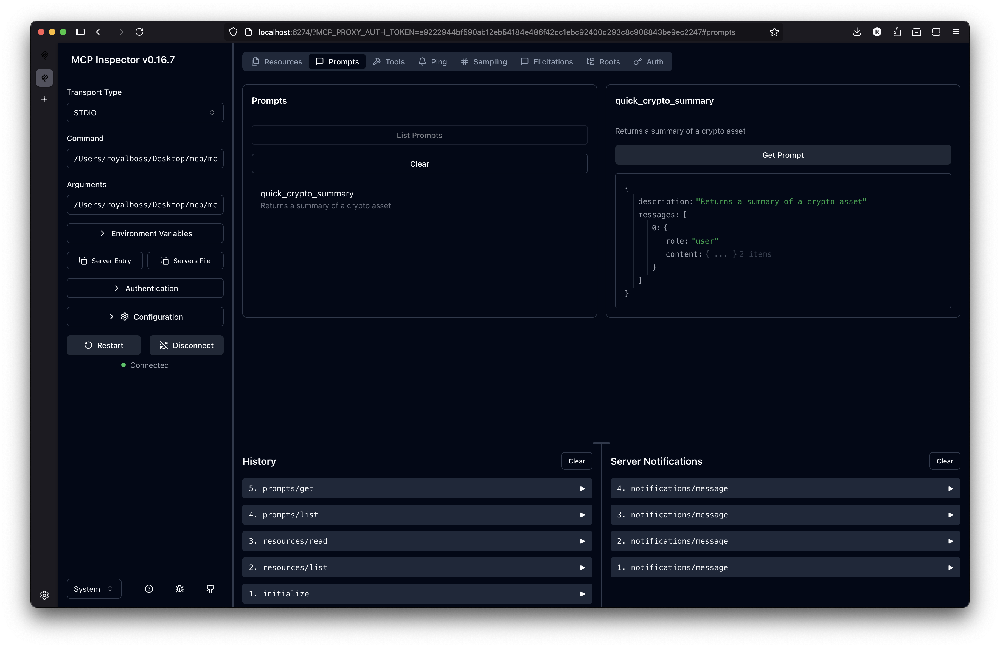
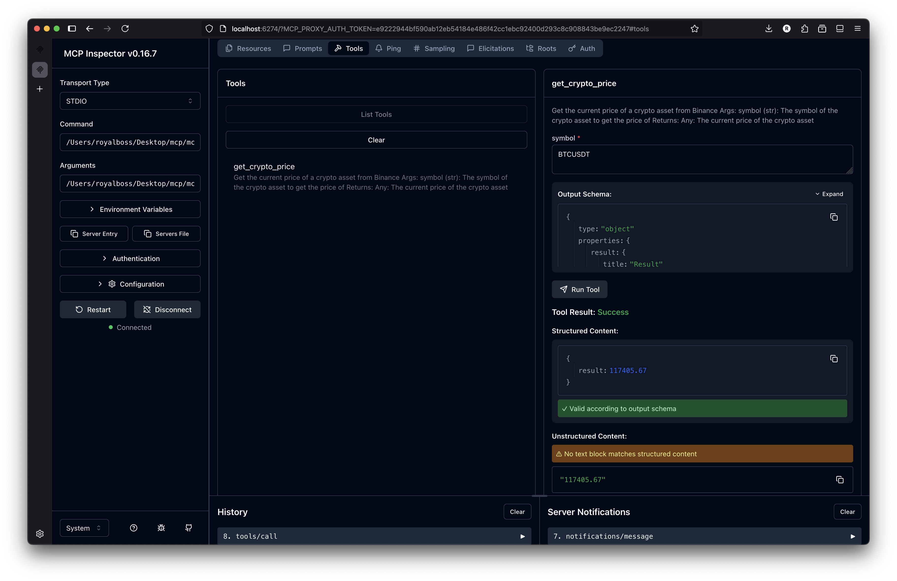

# Debug MCP with MCP Inspector

## Usage

General:

```bash
npx @modelcontextprotocol/inspector@latest <python-path> <mcp-server-file>
```

Example:

```bash
npx @modelcontextprotocol/inspector@latest <path-to-root-folder>/mcp_example/.venv/bin/python3 <path-to-root-folder>/mcp_example/mcp_server.py
```

## Output

### Inspecting Resources



### Inspecting Prompt



### Inspecting Tool


